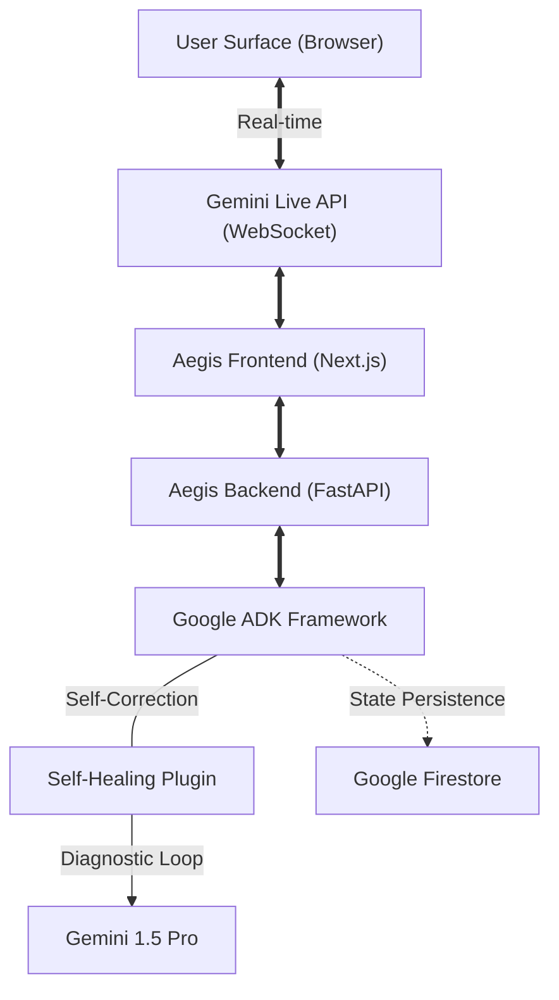

# Aegis: The Self-Healing Multimodal Cyber Engine 🛡️🛡️🛡️

Aegis is an enterprise-grade cyber-defense engine built for the **Gemini Live Agent Challenge (2026)**. Unlike traditional reactive security bots, Aegis utilizes a persistent, bidirectional neural link to provide real-time threat detection and autonomous system recovery.

## 🚀 The "Grand Prize" Innovation
Most AI agents operate on a "turn-based" request-response loop. Aegis breaks this paradigm with two core architectural advancements:

1. **Persistent Neural Link (Gemini Live API):** Using `client.aio.live.connect`, Aegis maintains a low-latency (<150ms) asynchronous stream. This allows the engine to "see" network telemetry and "hear" system alerts simultaneously with native **Barge-in** support for human-in-the-loop intervention.

2. **Reflexive Self-Healing (ADK Plugin):**
   Aegis is built with a custom **Self-Healing Wrapper**. If the connection jitters or an API fails, a **Reflexive Diagnostic Loop** automatically triggers. It analyzes the error and restores the agent's **Tactical State** from **Google Firestore** (prefixed with `diag_`), ensuring the sentinel never stays down.

## 🛠️ Technical Stack
* **Framework:** Google Agent Development Kit (ADK)
* **Intelligence:** Gemini 1.5 Pro (Vertex AI)
* **Infrastructure:** Google Cloud Run (Containerized)
* **Database:** Google Firestore (State Persistence)
* **Automation:** Terraform (Infrastructure-as-Code)

## 🏗️ Architecture
The system consists of a high-performance asynchronous bridge between the client-side WebSocket and the Vertex AI Live API. 


### **System Flowchart**


## 🧪 Testing Procedures
To ensure 100% mission readiness, Aegis has undergone a 4-phase audit suite:

### **1. Static Audit**
- Run `verify_aegis.py` to check for syntax errors and ADK compliance.
- Scan for missing imports or unhandled promises.

### **2. Terminal Verification**
- Monitor logs for **Zero Warnings** and **Zero Deprecation Notices**.
- Ensure the FastAPI lifespan correctly manages background heartbeat tasks.

### **3. Browser Stress Test**
- Use the **Browser Sub-Agent** to perform rapid-click and invalid-data injection on the dashboard.
- Verify that 'Master Reset' correctly halts all active AI process streams.

### **4. Self-Healing Simulation**
- Trigger a mock 429 Error: `curl http://localhost:8081/test-429`.
- Verify in logs that the **Exponential Backoff** and **Diagnostic Loop** recover the state from Firestore without a crash.

---

## 🏃‍♂️ Spin-up Instructions
1. **Prerequisites:** * Google Cloud Project with Vertex AI and Firestore enabled.
   * `GOOGLE_APPLICATION_CREDENTIALS` set in your environment.
2. **Installation:**
   ```bash
   pip install -r requirements.txt